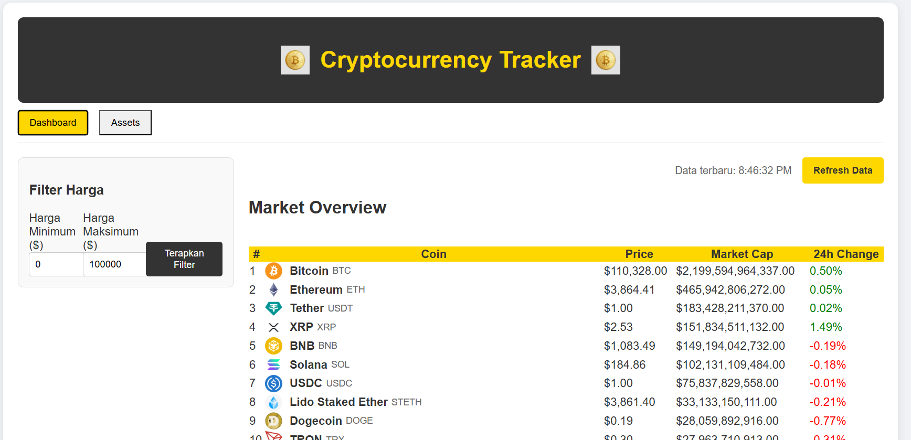
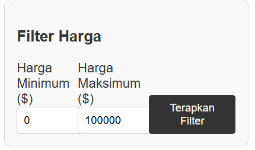
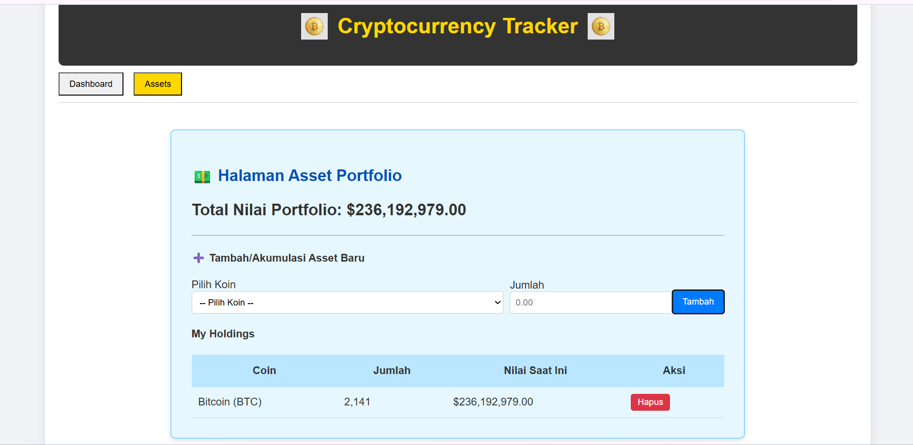
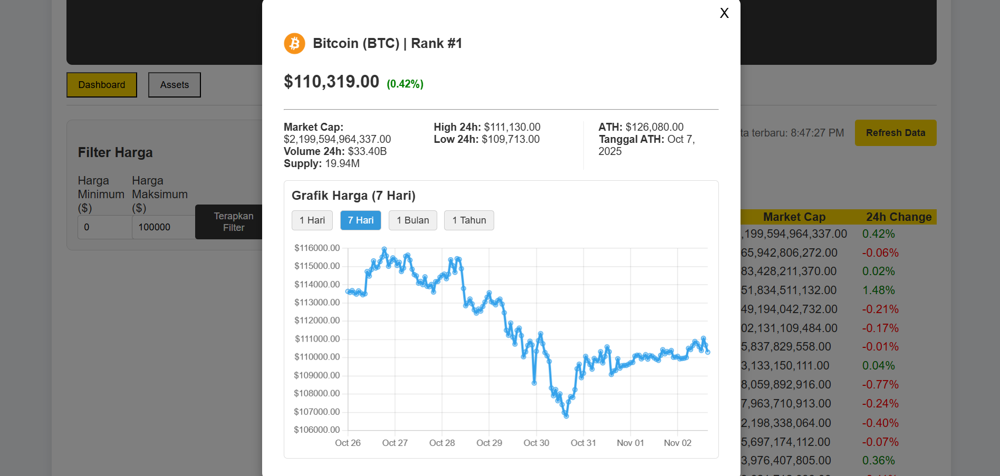
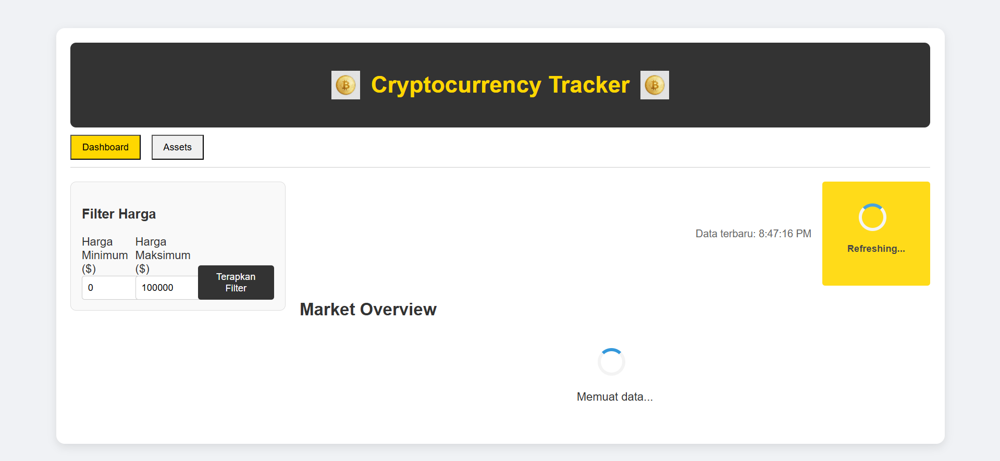

# uts-pemweb-123140032 - Cryptocurrency Tracker

## 👨‍💻 Informasi Mahasiswa
* **Nama:** Arrauf Setiawan Muhammad Jabar
* **NIM:** 123140032
* **Studi Kasus:** Digit Akhir 2 - Cryptocurrency Tracker (CoinGecko API)

## ✨ Deskripsi Proyek
Aplikasi pelacak harga cryptocurrency yang dibangun menggunakan **ReactJS** dan **Axios**. Proyek ini menampilkan Dashboard dengan tabel data koin, filter range harga, dan halaman terpisah untuk **Kalkulator Portfolio Aset** yang disimpan menggunakan **localStorage**. Aplikasi ini memenuhi kriteria responsive design dan integrasi API yang dinamis.

## 🔗 Link Pengumpulan
* **GitHub Repository:** https://github.com/arrauf02/uts-pemweb-123140032
* **URL Live App (Vercel):** https://uts-pemweb-123140032-xf1q.vercel.app/

## 🚀 Fitur Utama yang Diimplementasikan
1.  **Form Filter Harga:** Memfilter koin berdasarkan range harga minimum dan maksimum 
2.  **Tabel Data Dinamis:** Menampilkan 50 koin teratas dengan *data binding* 
3.  **Detail Koin & Chart:** Modal detail yang menampilkan data koin spesifik dan **grafik harga 7 hari** (*live data fetching* menggunakan endpoint historis CoinGecko).
4.  **Portfolio Calculator:** Halaman terpisah untuk manajemen aset (Tambah, Akumulasi, Hapus) menggunakan **localStorage** 
5.  **Responsive Design:** Tampilan adaptif menggunakan Media Queries dan Flexbox 

## 🛠️ Cara Instalasi dan Menjalankan
**⚠️ PRASYARAT WAJIB:** Pastikan Anda sudah menginstal **Node.js** (rekomendasi versi LTS) dan **npm (Node Package Manager)** di sistem Anda.
1.  Clone repository ini:
    ```bash
    git clone https://github.com/arrauf02/uts-pemweb-123140032.git
    cd uts-pemweb-123140032
    ```

2.  Instal dependencies (Axios, Chart.js, react-chartjs-2.):
    ```bash
    npm install Axios
    npm install Chart.js
    npm install react-chartjs-2
    ```
3.  Jalankan aplikasi:
    ```bash
    npm run dev
    ```

## 📸 Screenshot Aplikasi
### 1. Dashboard Utama (Market Overview)


### 2. Form Filter yang Aktif


### 3. Halaman Asset Portfolio


### 4. Modal Detail Koin & Chart


### 5. Tampilan Saat Refresh/Loading

